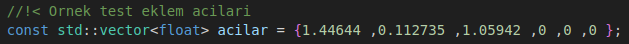

# ur10 6 DOF Kinematics

## Installation 

## Prerequisites
Before proceeding with the installation, ensure that the necessary dependencies are installed:
```
sudo apt update
sudo apt install ros-noetic-roscpp ros-noetic-nav-msgs ros-noetic-std-msgs
```

To install the simulation world:
```
git clone https://github.com/bugrahanturk/ur10_kinematics.git
mkdir -p gazebo_plugins_rtg/src
cd ur10_kinematics*
mv gazebo_plugins_rtg ../gazebo_plugins_rtg/src
cd ../gazebo_plugins_rtg
rosdep install -a
catkin_make
source ~/.bashrc
cp -r src/gazebo_plugins_rtg/models/ur10 ~/.gazebo/models
source devel/setup.bash
```

To start the simulation world (UR10):
```
roslaunch gazebo_plugins_rtg ur10.launch
```

To install ur10_kinematics:
```
cd ur10_kinematics*
mkdir src 
mv ur10_kinematics src
catkin_make
source devel/setup.bash
```

For observing the end-effector pose using forward kinematics:
```
rosrun ur10_6dof_kinematics forward_kinematics
```

To study the motion of the end-effector by inverse kinematics calculation (example 0.8 0.1 2.5 0.1 0.8 2.8):
```
rosrun ur10_6dof_kinematics inverse_kinematics 0.8 0.1 2.5 0.1 0.8 2.8
```

### Forward Kinematics
In advanced kinematics calculations, homogeneous rotation matrices for 6 joints were extracted in accordance with the robotic arm given in the question. As a result of the calculations, the accuracy of the theoretical calculation was proved by verifying the accuracy of the theoretical calculation with the odometry message information obtained from the simulation.

### Example Outputs

Expected output:

Theoretical Position

Theoretical Orientation Matrix


<p align="center">

</p>
  

### Inverse Kinematics
The joint angles obtained from inverse kinematics calculations were tested using forward kinematics calculations. In these tests, the joint angles calculated by inverse kinematics are given to the forward kinematics function and it is checked whether the end-effector reaches the target positions correctly.

As a result of these tests in the simulation environment, it was confirmed that the angles obtained by inverse kinematics calculations ensure that the end-effector reaches the target positions exactly. Thus, by testing the accuracy of both inverse kinematics and forward kinematics calculations, the positioning accuracy of the robot was successfully verified.

1) Test = P0(0.8, 0.7, 2.2) - P1(0.1, 0.8, 2.8)
<p align="center">


3) Test = P0(0.4, 0.4, 2.2) - P1(0.8, 0.8, 2.5)
<p align="center">


5) Test = P0(0.8, 0.1, 2.5) - P1(0.1, 0.8, 2.8)
<p align="center">


#### Inverse Kinematic Verification
The angles obtained in Test 3 were tested in the foward kinematics node. The angle values used and the position of the robot arm obtained are shown in the images below. The angle values at the start and end position of the robot were used. The following results can be confirmed by examining the starting and ending position of the gif above. 

Start 
<p align="center">


Finish
<p align="center">



