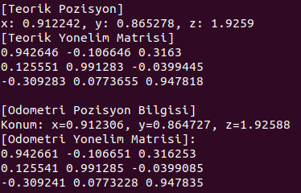

# ur10 6 DOF Kinematik

## Kurulum 
- Simülasyon dünyasını yüklemek için:
```
cd ~/robotlar_ws/src
git clone https://gitlab.com/blm6191_2425b/blm6191/gazebo_plugins_rtg.git
cd ~/robotlar_ws
rosdep install -a
catkin_make
source ~/.bashrc
cp -r ~/robotlar_ws/src/gazebo_plugins_rtg/models/ur10 ~/.gazebo/models
```

- Simülasyon ortamını başlatma:
```
roslaunch gazebo_plugins_rtg ur10.launch
```

- ur10_6dof_kinematics projesini yükleme:
```
git clone https://gitlab.com/blm6191_2425b/members/23501021/blm6191-robotlar-odev-2
cd ur10_6dof_kinematics
catkin build
```

- İleri kinematik hesabı ile end-effector'ün hareketini incelemek için:
```
rosrun ur10_6dof_kinematics forward_kinematics
```

- Ters kinematik hesabı ile end-effector'ün hareketini incelemek için(örnek 0.8 0.1 2.5 0.1 0.8 2.8):
```
rosrun ur10_6dof_kinematics inverse_kinematics 0.8 0.1 2.5 0.1 0.8 2.8
```

### İleri Kinematik
İleri kinematik hesaplamalarında soruda verilen robotik kola uygun bir şekilde, 6 eklem için rotasyon matrisleri çıkarılmıştır. Yapılan hesaplamalar sonucunda teorik hesabın doğruluğu simülasyondan alınan odometri mesaj bilgisi ile doğrulanarak kanıtlanmıştır.

<p align="center">

</p>
  

### Ters Kinematik
Ters kinematik hesaplamaları sonucunda elde edilen eklem açıları, ileri kinematik hesaplamaları kullanılarak test edilmiştir. Bu testlerde, ters kinematik ile hesaplanan eklem açıları ileri kinematik fonksiyonuna verilmiş ve uç efektörün (end-effector) hedef pozisyonlara doğru bir şekilde ulaşıp ulaşmadığı kontrol edilmiştir.

Simülasyon ortamında yapılan bu testler sonucunda, ters kinematik hesaplamalarıyla elde edilen açıların, uç efektörün hedef pozisyonlara tam olarak ulaşmasını sağladığı doğrulanmıştır. Böylece, hem ters kinematik hem de ileri kinematik hesaplamalarının doğruluğu test edilerek robotun pozisyonlama doğruluğu başarılı bir şekilde doğrulanmıştır.

- 1) Test = P0(0.8, 0.7, 2.2) - P1(0.1, 0.8, 2.8) 


- 2) Test = P0(0.4, 0.4, 2.2) - P1(0.8, 0.8, 2.5) 


- 3) Test = P0(0.8, 0.1, 2.5) - P1(0.1, 0.8, 2.8) 


#### Ters Kinematik Doğrulama
Test 3'te elde edilen açılar kullanılarak foward kinematik node'unda test edilmiştir. Kullanılan açı değerleri ve elde edilen robot kolun pozisyonu aşağıdaki görsellerde görülmektedir. Robotun başlangıç ve bitiş pozisyonundaki açı değerleri kullanılmıştır. Bir üstteki gif'in başladığı ve bittiği konum incelenerek aşağıdaki sonuçlar teyit edilebilmektedir. 

- Başlangıç 


- Bitiş


